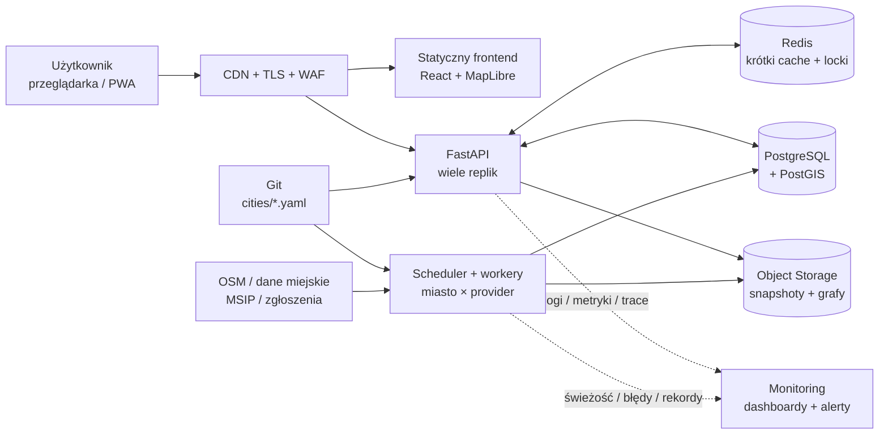

# Architektura

System jest wielomiejski z założenia: kod aplikacji nie zna listy miast. Miasto opisuje
plik `backend/cities/<miasto>.yaml`, a źródła danych są wymiennymi providerami. Ten sam
obraz backendu może więc obsługiwać kolejne miasta bez kopiowania endpointów, modeli ani
logiki routingu.

Dokument rozróżnia **stan obecny** (demo uruchamiane przez Docker Compose) i
**architekturę docelową** potrzebną do niezawodnego hostingu wielu miast.

## Diagram produkcyjny — wersja na slajd



Opis tekstowy diagramu: użytkownik pobiera frontend z CDN i wywołuje API za warstwą TLS/WAF.
Repliki API korzystają ze współdzielonych Redis, PostgreSQL/PostGIS i storage obiektowego.
Osobne workery odświeżają każdą parę miasto–provider według konfiguracji YAML, a API i workery
wysyłają telemetrię do jednego systemu monitoringu.

## Stan obecny i docelowy

| Obszar        | Stan obecny                     | Produkcja                                                               |
| ------------- | ------------------------------- | ----------------------------------------------------------------------- |
| Frontend      | Vite w kontenerze               | statyczny build w object storage, dystrybucja przez CDN                 |
| API           | pojedynczy proces FastAPI       | co najmniej 2 bezstanowe repliki za load balancerem                     |
| Baza          | PostgreSQL + PostGIS            | zarządzana baza Multi-AZ, backupy i point-in-time recovery              |
| Cache danych  | `data/cache/<city>/` na dysku   | wersjonowane snapshoty w object storage, lokalny cache tylko jako kopia |
| Cache zapytań | pamięć procesu (np. geokoder)   | współdzielony Redis z TTL i kluczami zawierającymi miasto               |
| Import danych | ręczne `seed` / `seed-refresh`  | scheduler i osobne workery dla par `miasto × provider`                  |
| Monitoring    | `/api/health` i logi kontenerów | metryki, logi strukturalne, tracing, dashboardy i alerty                |

Elementy kolumny „Produkcja” są architekturą docelową, nie opisem już wdrożonych usług.

## Nowe miasto = YAML + providery

### Kontrakt konfiguracji

`backend/app/cities.py` ładuje wszystkie pliki `backend/cities/*.yaml` i waliduje je modelem
`CityConfig`. Minimalna konfiguracja miasta zawiera:

```yaml
id: nowe_miasto
name: Nowe Miasto
country: PL
timezone: Europe/Warsaw

# [south, west, north, east], WGS84
bbox: [50.00, 19.00, 50.20, 19.30]
center: [50.10, 19.15]
default_zoom: 13

providers:
  - name: osm
    enabled: true
    options:
      overpass_url: https://example.org/api/interpreter
      timeout_s: 60
  - name: user_reports
    enabled: true
    options: {}

routing:
  network_type: walk
  overpass_url: https://example.org/api/interpreter
```

| Pole                     | Rola                                                   |
| ------------------------ | ------------------------------------------------------ |
| `id`                     | stabilny identyfikator w API, bazie, cache i metrykach |
| `bbox`                   | granice walidacji zapytań i zgłoszeń                   |
| `demo_bbox`              | opcjonalny mniejszy obszar danych demonstracyjnych     |
| `center`, `default_zoom` | domyślny widok klienta                                 |
| `providers`              | kolejność, włączenie i opcje źródeł danych             |
| `routing`                | parametry budowy grafu pieszego                        |

### Kiedy wystarcza YAML

Jeżeli provider obsługuje standardowe źródło, np. OSM, dodanie miasta wymaga tylko nowego
YAML-a i przygotowania danych startowych. Opcje połączenia, warstwy i identyfikatory zbiorów
należą do `providers[].options`, a nie do instrukcji `if city == ...` w kodzie.

Nowa klasa providera jest potrzebna wyłącznie wtedy, gdy lokalne źródło ma nowy protokół lub
format. Taki provider:

1. dziedziczy po `Provider` w `backend/app/providers/`;
2. rejestruje się przez `@register_provider("nazwa")`;
3. jest importowany w `backend/app/providers/__init__.py`;
4. zwraca wspólny model `Place` i `AccessibilityAttribute` z provenance;
5. otrzymuje adresy zbiorów i warstw przez YAML, dzięki czemu może być użyty ponownie.

### Procedura uruchomienia miasta

1. Dodać i zwalidować `backend/cities/<id>.yaml`; `id` nie może kolidować z istniejącym.
2. Włączyć wspólne providery i dopisać tylko brakujące integracje lokalne.
3. Sprawdzić licencje, mapowanie atrybutów, bbox, strefę czasową i kompletność provenance.
4. Zbudować graf pieszy oraz snapshoty startowe w `data/seed/<id>/`.
5. Uruchomić test rejestracji providerów, import do bazy i próbne trasy w granicach miasta.
6. W produkcji utworzyć harmonogramy, dashboard i alerty z etykietą `city=<id>`.
7. Opublikować miasto dopiero po teście dostępności UI i procedury fallbacku na cache.

Dodanie miasta nie może wymagać zmian w endpointach ani rozgałęzień po nazwie miasta.

## Przepływ danych

### Żądanie użytkownika

1. Frontend wysyła `city` oraz parametry zapytania do `/api/*`.
2. Backend pobiera `CityConfig`, waliduje współrzędne względem bbox i wybiera dane miasta.
3. Odczyty miejsc i atrybutów trafiają do PostgreSQL/PostGIS; krótko żyjące wyniki mogą być
   buforowane w Redisie.
4. Routing używa opublikowanej wersji grafu miasta. Koszt krawędzi zależy od profilu
   (`wheelchair`, `stroller`) i preferencji użytkownika.
5. Odpowiedź JSON zawiera dane, provenance i confidence; OpenAPI generuje typy frontendu.

### Odświeżenie danych

1. Scheduler tworzy idempotentne zadanie dla pary `city × provider`; lock w Redisie blokuje
   równoległe uruchomienie tej samej pary.
2. Worker pobiera dane do tymczasowej, wersjonowanej lokalizacji.
3. Waliduje schemat, bbox, liczbę rekordów i wymagane provenance.
4. Dopiero poprawny wynik atomowo publikuje jako nową wersję snapshotu.
5. Normalizacja (`normalization/merge.py`) rozwiązuje konflikty i zapisuje aktualny widok do
   PostgreSQL/PostGIS.
6. Po publikacji worker unieważnia właściwe klucze Redis i emituje metryki. Błąd pozostawia
   poprzednią poprawną wersję aktywną.

Szczegóły utrzymania danych, moderacji i progów świeżości opisuje
[`data-operations.md`](data-operations.md).

## Cache i odporność na awarie

| Warstwa            | Zawartość                                 | Trwałość        | Zasada unieważniania                               |
| ------------------ | ----------------------------------------- | --------------- | -------------------------------------------------- |
| CDN                | frontend i bezpieczne odpowiedzi GET      | minuty–dni      | hash pliku lub krótki TTL API                      |
| Redis              | geokodowanie, gorące odczyty, locki zadań | sekundy–godziny | TTL oraz event po publikacji danych                |
| PostgreSQL/PostGIS | aktualny znormalizowany widok             | trwała          | transakcja importu nowej wersji                    |
| Object storage     | surowe dane, cache providerów, grafy      | wersjonowana    | bez nadpisywania; zmiana wskaźnika aktywnej wersji |
| Dysk repliki       | rozpakowany graf i cache roboczy          | nietrwała       | pobranie po starcie lub zmianie wersji             |

Klucz cache zawsze zawiera co najmniej `city`, provider/operację i wersję danych. Lokalny dysk
kontenera nie jest źródłem prawdy. Awaria źródła zewnętrznego nie usuwa ostatniego poprawnego
snapshotu; odpowiedź powinna ujawnić, że pochodzi z cache i kiedy dane pobrano.

## Hosting i skalowanie

- Frontend jest statyczny i skaluje się przez CDN niezależnie od API.
- API jest bezstanowe; sesje, locki i cache współdzielone nie mogą istnieć wyłącznie w pamięci
  jednej repliki.
- Workery importu są oddzielone od API, aby wolny Overpass lub przebudowa grafu nie zużywały
  puli obsługującej użytkowników.
- API skaluje się horyzontalnie według ruchu, opóźnienia i użycia CPU; workery według długości
  kolejki. Ciężkie zadania routingu mają limity czasu i współbieżności.
- PostgreSQL/PostGIS jest wspólnym stanem transakcyjnym. Połączenia przechodzą przez pulę, a
  zapytania przestrzenne mają indeksy po geometrii i `city_id`.
- Dane każdego miasta są logicznie izolowane przez `city_id`; duże miasta można później
  przenieść do osobnych workerów, partycji lub baz bez zmiany kontraktu API.
- Sekrety pochodzą z menedżera sekretów, ruch publiczny używa TLS, a WAF/rate limiting chronią
  kosztowne endpointy i formularz zgłoszeń.

## Monitoring i alarmowanie

Każdy log, metric i trace ma pola `environment`, `city`, a dla importów także `provider` oraz
`run_id`. Komentarze użytkowników i inne treści zgłoszeń nie trafiają do telemetrii.

### Sygnały

| Warstwa   | Metryki / zdarzenia                                                         |
| --------- | --------------------------------------------------------------------------- |
| API       | liczba żądań, p50/p95/p99, 4xx/5xx, anulowania, aktywne requesty            |
| Routing   | czas wyznaczania kandydatów, brak trasy, liczba i wiek wersji grafu         |
| Providery | `live/cache/failed`, czas zadania, liczba rekordów i zmian, wiek danych     |
| Cache     | hit ratio, opóźnienie, błędy, pamięć, wygasłe locki                         |
| Baza      | dostępność, pula połączeń, wolne zapytania, rozmiar i opóźnienie replikacji |
| Workery   | długość kolejki, wiek najstarszego zadania, retry i dead-letter queue       |

### Minimalne alerty

- `/api/health` lub readiness nie przechodzi na co najmniej dwóch kolejnych pomiarach;
- odsetek 5xx przekracza 2% przez 5 minut;
- p95 routingu przekracza 2 sekundy przez 15 minut;
- provider ma stan `failed` bez poprawnego cache albo dane przekraczają próg świeżości;
- liczba rekordów importu zmienia się o ponad ustalony próg bez zatwierdzenia;
- rośnie kolejka, kończy się miejsce, baza jest niedostępna lub backup nie wykonał się.

Dashboard musi pozwalać przejść od widoku całej usługi do miasta, providera i pojedynczego
`run_id`. Runbook do alertów powinien wskazywać fallback na cache, rollback snapshotu oraz
osobę odpowiedzialną za źródło.

## Wdrożenia, backup i odtwarzanie

1. CI waliduje wszystkie YAML-e, rejestrację providerów, migracje, testy i generowane typy API.
2. Jeden niezmienny obraz aplikacji jest promowany między środowiskami; konfiguracja i sekrety
   różnią środowiska, nie kod.
3. Migracje bazy wykonuje osobne zadanie przed rolling deploymentem API.
4. Snapshoty i grafy są wersjonowane; publikacja zmienia wskaźnik aktywnej wersji, więc rollback
   nie wymaga ponownego pobierania danych.
5. Baza ma automatyczne backupy i point-in-time recovery. Procedura odtworzenia jest regularnie
   testowana, nie tylko opisana.

## Kluczowe decyzje

| Decyzja                                         | Dlaczego                                                          |
| ----------------------------------------------- | ----------------------------------------------------------------- |
| Web/PWA zamiast natywnej aplikacji              | WCAG łatwo audytować, a wdrożenie i demo są dostępne przez link   |
| Miasto jako plik YAML                           | nowe miasto bez kopiowania kodu i osobnego obrazu aplikacji       |
| Providery jako rejestr pluginów                 | lokalne źródła są wymienne, testowalne i konfigurowalne           |
| Provenance w modelu od początku                 | wiarygodność danych, obsługa konfliktów i kontrola świeżości      |
| Wersjonowane snapshoty                          | bezpieczny fallback, audyt zmian i szybki rollback                |
| API i importy jako osobne procesy               | awaria źródła lub ciężki import nie zatrzymuje ruchu użytkowników |
| Routing w Pythonie (`osmnx` + `networkx`)       | pełna kontrola nad wagami i wspólny stos technologiczny zespołu   |
| Preferencje zamiast pytania o niepełnosprawność | prywatność i godność użytkownika                                  |
